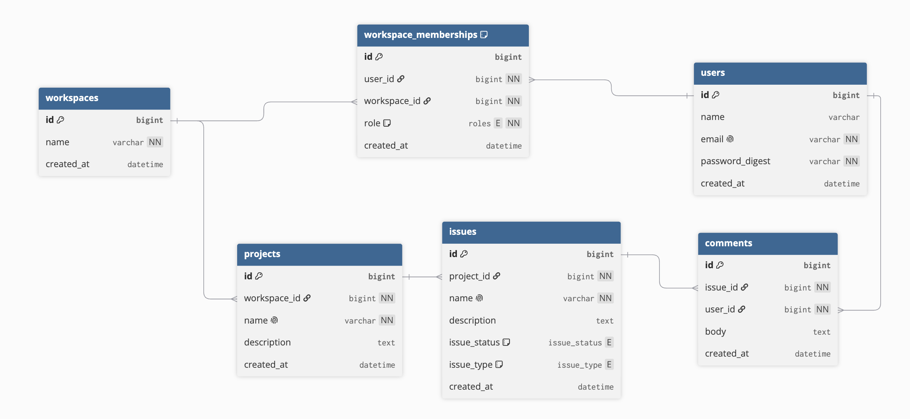

# Database Reference

This document summarizes the current database model for the Rails API.

- Source of truth: `api/db/schema.rb`
- Format: DBML-style reference for readability
- DBML docs: https://dbml.dbdiagram.io/docs



```dbml
Enum issue_type {
  task
  bug
  story
  feature
}

Enum issue_status{
  to_do
  in_progress
  review
  done
}

Enum roles {
  manager
  developer
}

Table users {
  id bigint [pk, increment]
  name varchar
  email varchar [not null, unique]
  password_digest varchar [not null]
  created_at datetime
}

Table workspaces {
  id bigint [pk, increment]
  name varchar [not null]
  created_at datetime
}

Table workspace_memberships {
  id bigint [pk, increment]
  user_id bigint [not null]
  workspace_id bigint [not null]
  role roles [not null]
  created_at datetime

  indexes {
    (user_id, workspace_id) [unique]
  }
}

Table projects {
  id bigint [pk, increment]
  workspace_id bigint [not null]
  name varchar [not null, unique]
  description text
  created_at datetime
}

Table issues {
  id bigint [pk, increment]
  project_id bigint [not null]
  name varchar [not null, unique]
  description text
  issue_status issue_status [default: 'to_do']
  issue_type issue_type [default: 'story']
  created_at datetime
}

Table comments {
  id bigint [pk, increment]
  issue_id bigint [not null]
  user_id bigint [not null]
  body text
  created_at datetime
}

/* Relations */

Ref: workspace_memberships.user_id > users.id
Ref: workspace_memberships.workspace_id > workspaces.id

Ref: projects.workspace_id > workspaces.id

Ref: issues.project_id > projects.id

Ref: comments.issue_id > issues.id
Ref: comments.user_id > users.id
```

## Key relationships

- `users` ↔ `workspaces` is many-to-many through `workspace_memberships`, with `role` (`Roles` enum) indicating the user's role in that workspace.
- `workspaces` has many `projects`.
- `projects` has many `issues`.
- `issues` has many `comments`.
- `users` has many `comments` (each comment belongs to exactly one author).
- `issues.issue_status` and `issues.issue_type` are constrained by the `IssueStatus` and `IssueType` enums, respectively.