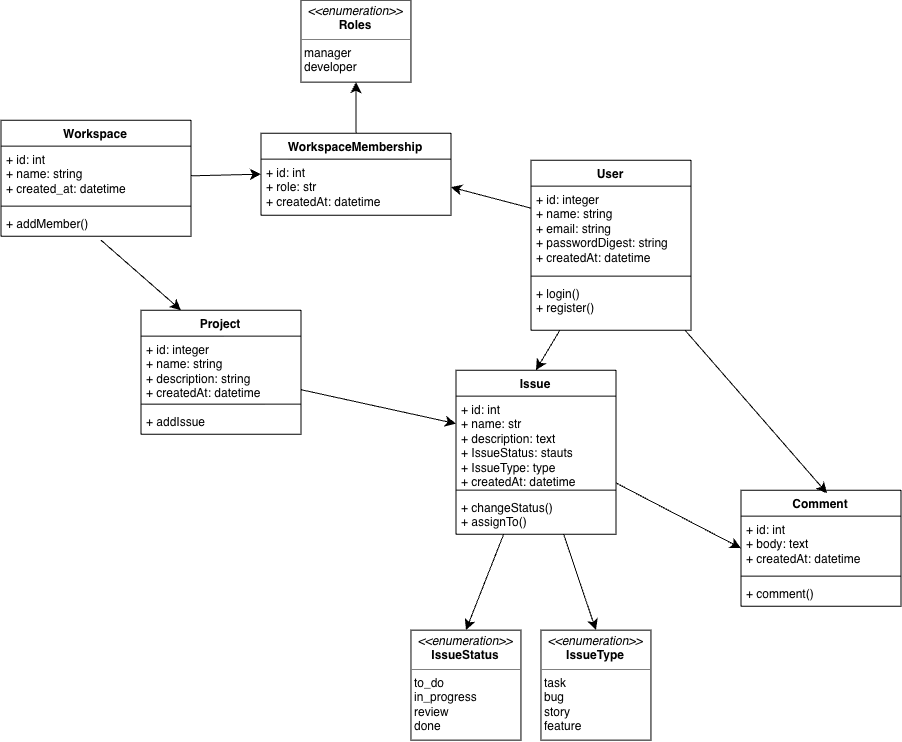

**Jira-like API user stories**

**Guest**

* As a guest, I can register a new account: `POST /api/v1/auth/register`
* As a guest, I can log in and receive an authentication token: `POST /api/v1/auth/login`

**Authenticated user**

* As an authenticated user, I can view my own profile: `GET /api/v1/users/me`
* As an authenticated user, I can view public profile details of another user: `GET /api/v1/users/:id`
* As an authenticated user, I can list workspaces available to me: `GET /api/v1/workspaces`
* As an authenticated user, I can view a workspace detail: `GET /api/v1/workspaces/:id`
* As an authenticated user, I can create a new workspace: `POST /api/v1/workspaces`

**Workspace Member**

* As a workspace member, I can list projects in my workspace: `GET /api/v1/workspaces/:workspace_id/projects`
* As a workspace member, I can view project details: `GET /api/v1/projects/:id`
* As a workspace member, I can list workspace members: `GET /api/v1/workspaces/:workspace_id/memberships`
* As a workspace member, I can list issues in a project: `GET /api/v1/projects/:project_id/issues`
* As a workspace member, I can filter issues by status (`to_do`, `in_progress`, `review`, `done`) or type (`task`, `bug`, `story`, `feature`): `GET /api/v1/projects/:project_id/issues?status=...&type=...`
* As a workspace member, I can view an issue detail: `GET /api/v1/issues/:id`
* As a workspace member, I can change the status of an issue: `PATCH /api/v1/issues/:id/status`
* As a workspace member, I can assign an issue to a user: `PATCH /api/v1/issues/:id/assign`
* As a workspace member, I can view comments on an issue: `GET /api/v1/issues/:issue_id/comments`
* As a workspace member, I can leave a comment on an issue: `POST /api/v1/issues/:issue_id/comments`

**Workspace Manager (Role: manager)**

* As a workspace manager, I can add a new member to the workspace with a role (`manager` or `developer`): `POST /api/v1/workspaces/:workspace_id/memberships`
* As a workspace manager, I can update a member's role in the workspace: `PATCH /api/v1/workspaces/:workspace_id/memberships/:id`
* As a workspace manager, I can remove a member from the workspace: `DELETE /api/v1/workspaces/:workspace_id/memberships/:id`
* As a workspace manager, I can create a new project in the workspace: `POST /api/v1/workspaces/:workspace_id/projects`
* As a workspace manager, I can update project details: `PATCH /api/v1/projects/:id`
* As a workspace manager, I can delete a project: `DELETE /api/v1/projects/:id`
* As a workspace manager, I can create an issue in a project: `POST /api/v1/projects/:project_id/issues`
* As a workspace manager, I can update issue details (name, description, type): `PATCH /api/v1/issues/:id`
* As a workspace manager, I can delete an issue: `DELETE /api/v1/issues/:id`

**Developer (Role: developer)**

* As a developer, I can create an issue within an assigned project: `POST /api/v1/projects/:project_id/issues`
* As a developer, I can update issues, change statuses, and assign them to members: `PATCH /api/v1/issues/:id`
